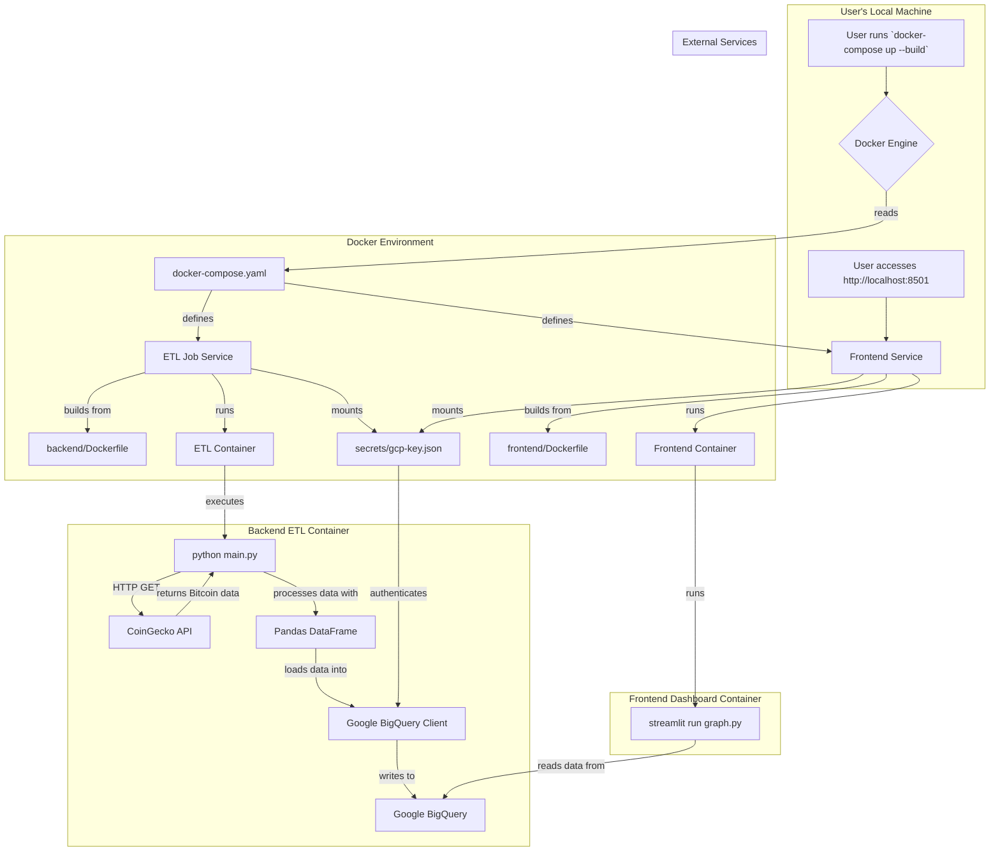

# docker-gcp-crypto

This project implements a containerized, multi-service application using Docker and Python. It consists of:
1.  **An ETL Pipeline**: A backend service that periodically fetches Bitcoin exchange rates from the CoinGecko API, processes the data with Pandas, and loads it into a Google BigQuery table.
2.  **A Data Dashboard**: A frontend Streamlit service that visualizes the price history stored in BigQuery.

Configuration for both services (GCP Project ID, dataset, table) is managed via environment variables in a `docker-compose.yaml` file. Authentication to GCP is handled securely through a mounted service account key file.

## Project Workflow

This section describes the end-to-end process, from data ingestion by the backend to visualization by the frontend.

### Workflow Diagram

### Explanation

#### Backend: ETL Job
1.  **User Interaction**: The process starts when the user runs `docker-compose up`.
2.  **Docker Compose**: Docker Compose reads the `docker-compose.yaml` file and starts the defined services.
3.  **ETL Job Service**: It builds and runs the `etl-job` container from the `backend/Dockerfile`.
4.  **Secret Mounting**: A `gcp-key.json` file is securely mounted into the container for authentication.
5.  **Data Fetching (Extract)**: The container's `main.py` script calls the CoinGecko API to get Bitcoin prices.
6.  **Data Processing (Transform)**: The raw data is structured into a Pandas DataFrame.
7.  **Data Loading (Load)**: The script authenticates to Google Cloud and loads the DataFrame into the `bitcoin_rates` table in BigQuery.

#### Frontend: Dashboard
8.  **Frontend Service**: Docker Compose also builds and runs the `frontend` container, which starts the Streamlit application.
9.  **User Access**: The user navigates to `http://localhost:8501` in their browser.
10. **Data Visualization**: The Streamlit app queries the same BigQuery table, fetches the historical price data, and displays it in an interactive chart and a table.
11. **Caching**: The data is cached by Streamlit to prevent excessive queries to BigQuery, with a "Refresh" button to manually fetch the latest data.